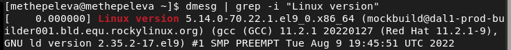
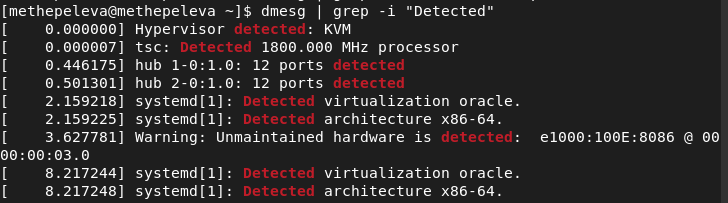
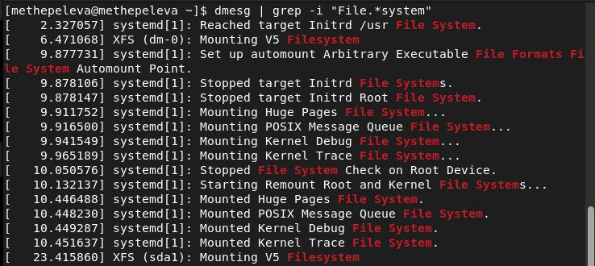
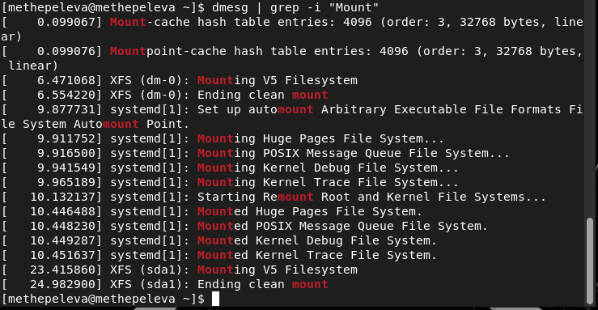

---
# Front matter
title: "Лабораторная работа 1"
author: "Щепелева Марина Евгеньевна, НФИбд-01-19"

# Generic otions
lang: ru-RU
toc-title: "Содержание"

# Bibliography
bibliography: bib/cite.bib
csl: pandoc/csl/gost-r-7-0-5-2008-numeric.csl

# Pdf output format
toc: true # Table of contents
toc_depth: 2
lof: true # List of figures
lot: true # List of tables
fontsize: 12pt
linestretch: 1.5
papersize: a4
documentclass: scrreprt
## I18n
polyglossia-lang:
  name: russian
  options:
	- spelling=modern
	- babelshorthands=true
polyglossia-otherlangs:
  name: english
### Fonts
mainfont: PT Serif
romanfont: PT Serif
sansfont: PT Sans
monofont: PT Mono
mainfontoptions: Ligatures=TeX
romanfontoptions: Ligatures=TeX
sansfontoptions: Ligatures=TeX,Scale=MatchLowercase
monofontoptions: Scale=MatchLowercase,Scale=0.9
## Biblatex
biblatex: true
biblio-style: "gost-numeric"
biblatexoptions:
  - parentracker=true
  - backend=biber
  - hyperref=auto
  - language=auto
  - autolang=other*
  - citestyle=gost-numeric
## Misc options
indent: true
header-includes:
  - \linepenalty=10 # the penalty added to the badness of each line within a paragraph (no associated penalty node) Increasing the value makes tex try to have fewer lines in the paragraph.
  - \interlinepenalty=0 # value of the penalty (node) added after each line of a paragraph.
  - \hyphenpenalty=50 # the penalty for line breaking at an automatically inserted hyphen
  - \exhyphenpenalty=50 # the penalty for line breaking at an explicit hyphen
  - \binoppenalty=700 # the penalty for breaking a line at a binary operator
  - \relpenalty=500 # the penalty for breaking a line at a relation
  - \clubpenalty=150 # extra penalty for breaking after first line of a paragraph
  - \widowpenalty=150 # extra penalty for breaking before last line of a paragraph
  - \displaywidowpenalty=50 # extra penalty for breaking before last line before a display math
  - \brokenpenalty=100 # extra penalty for page breaking after a hyphenated line
  - \predisplaypenalty=10000 # penalty for breaking before a display
  - \postdisplaypenalty=0 # penalty for breaking after a display
  - \floatingpenalty = 20000 # penalty for splitting an insertion (can only be split footnote in standard LaTeX)
  - \raggedbottom # or \flushbottom
  - \usepackage{float} # keep figures where there are in the text
  - \floatplacement{figure}{H} # keep figures where there are in the text
---

<h1 align="center">

РОССИЙСКИЙ УНИВЕРСИТЕТ ДРУЖБЫ НАРОДОВ 

Факультет физико-математических и естественных наук  

Кафедра прикладной информатики и теории вероятностей

ОТЧЕТ ПО ЛАБОРАТОРНОЙ РАБОТЕ №1
  
<h2 align="right">

Дисциплина: Информационная безопасность

Преподователь: Кулябов Дмитрий Сергеевич

Студент: Щепелева Марина Евгеньевна

Группа: НФИбд-01-19
  
  
<h1 align="center">

МОСКВА

2022 г.
</h1>

# **Цель работы**

Установить Rocky на виртуальную машину и проанализировать последовательность загрузки системы.

# **Теоретическое введение**

Команда для показа последовательности загрузки системы - dmesg. Можно использовать dmesg | less, чтобы уместить всё на экран, или dmesg | grep -i "что ищем", чтобы найти нужную нам информацию.

# **Выполнение лабораторной работы**

Я выполнила установку Rocky, согласно представленным в методичке данным.

После перезапуска системы и входа в графическое окружение, я открыла терминал, в котором ввела команду dmesg | less, чтобы увидеть последовательность загрузки системы (Рис [@fig:001]).

{ #fig:001 width=90% }

Необходимо было получить следующую информацию:

1. Версия ядра Linux (Linux version) (Рис [@fig:002]).

Версия оказалась Linux 5.14.0

{ #fig:002 width=90% }

2. Частота процессора (Detected Mhz processor) (Рис [@fig:003]).

Получила частоту процессора 1800 мега герц.

{ #fig:003 width=90% }

3. Модель процессора (CPU0) (Рис [@fig:004]).

Процессор - Intel Core i5-5350U

{ #fig:004 width=90% }

4. Объем доступной оперативной памяти (Memory available) (Рис [@fig:005]).

Как можно заметить, памяти 260860/2096696 Кб. То есть выделено 2 Гб оперативной памяти.

{ #fig:005 width=90% }

5. Тип обнаруженного гипервизора (Hypervisor detected) (Рис [@fig:006]).

Hypervisor detected: KVM

{ #fig:006 width=90% }

6. Тип файловой системы корневого раздела (Рис [@fig:007]).

Для нашего диска, а именно sda1, тип файловой системы XFS.

{ #fig:007 width=90% }

7. Последовательность монтирования файловых систем (Рис [@fig:008]).

Сначала монтируется Huge Pages FS, POSIX Message Queue FS, Kernel Debug FS, Kernel Trace FS и наконец Root and Kernel FS

{ #fig:008 width=90% }

# Выводы

Выполнив данную лабораторную работу, я установила Rocky на виртуальную машину, а также изучила последовательность загрузки операционной системы, выполнив команду dmesg.

# Список литературы

1. Кулябов, Д.С. - Лабораторная работа № 1. Установка и конфигурация операционной системы на виртуальную машину  
https://esystem.rudn.ru/pluginfile.php/1651880/mod_folder/content/0/001-lab_virtualbox.pdf
