---
# Front matter
title: "Лабораторная работа 3"
author: "Щепелева Марина Евгеньевна, НФИбд-01-19"

# Generic otions
lang: ru-RU
toc-title: "Содержание"

# Bibliography
bibliography: bib/cite.bib
csl: pandoc/csl/gost-r-7-0-5-2008-numeric.csl

# Pdf output format
toc: true # Table of contents
toc_depth: 2
lof: true # List of figures
lot: true # List of tables
fontsize: 12pt
linestretch: 1.5
papersize: a4
documentclass: scrreprt
## I18n
polyglossia-lang:
  name: russian
  options:
	- spelling=modern
	- babelshorthands=true
polyglossia-otherlangs:
  name: english
### Fonts
mainfont: PT Serif
romanfont: PT Serif
sansfont: PT Sans
monofont: PT Mono
mainfontoptions: Ligatures=TeX
romanfontoptions: Ligatures=TeX
sansfontoptions: Ligatures=TeX,Scale=MatchLowercase
monofontoptions: Scale=MatchLowercase,Scale=0.9
## Biblatex
biblatex: true
biblio-style: "gost-numeric"
biblatexoptions:
  - parentracker=true
  - backend=biber
  - hyperref=auto
  - language=auto
  - autolang=other*
  - citestyle=gost-numeric
## Misc options
indent: true
header-includes:
  - \linepenalty=10 # the penalty added to the badness of each line within a paragraph (no associated penalty node) Increasing the value makes tex try to have fewer lines in the paragraph.
  - \interlinepenalty=0 # value of the penalty (node) added after each line of a paragraph.
  - \hyphenpenalty=50 # the penalty for line breaking at an automatically inserted hyphen
  - \exhyphenpenalty=50 # the penalty for line breaking at an explicit hyphen
  - \binoppenalty=700 # the penalty for breaking a line at a binary operator
  - \relpenalty=500 # the penalty for breaking a line at a relation
  - \clubpenalty=150 # extra penalty for breaking after first line of a paragraph
  - \widowpenalty=150 # extra penalty for breaking before last line of a paragraph
  - \displaywidowpenalty=50 # extra penalty for breaking before last line before a display math
  - \brokenpenalty=100 # extra penalty for page breaking after a hyphenated line
  - \predisplaypenalty=10000 # penalty for breaking before a display
  - \postdisplaypenalty=0 # penalty for breaking after a display
  - \floatingpenalty = 20000 # penalty for splitting an insertion (can only be split footnote in standard LaTeX)
  - \raggedbottom # or \flushbottom
  - \usepackage{float} # keep figures where there are in the text
  - \floatplacement{figure}{H} # keep figures where there are in the text
---

<h1 align="center">

РОССИЙСКИЙ УНИВЕРСИТЕТ ДРУЖБЫ НАРОДОВ 

Факультет физико-математических и естественных наук  

Кафедра прикладной информатики и теории вероятностей

ОТЧЕТ ПО ЛАБОРАТОРНОЙ РАБОТЕ №3
  
<h2 align="right">

дисциплина: Информационная безопасность

Преподователь: Кулябов Дмитрий Сергеевич

Студент: Щепелева Марина Евгеньевна

Группа: НФИбд-01-19
  
  
<h1 align="center">

МОСКВА

2022 г.
</h1>

# **Цель работы**

Получение практических навыков работы в консоли с атрибутами файлов для групп пользователей.

# **Теоретическое введение**

useradd - добавление пользователя

passwd - установка пароля

pwd - местоположение по файловой системе

whoami - узнать логин

id - информация о пользователе

chmod - изменение атрибутов файла

newgrp - регистрация пользователя в группе

# **Выполнение лабораторной работы**

1. На виртуальной машине создала нового пользователя guest2 и задал для него пароль. Пользователь guest уже был создан (Рис [@fig:1])

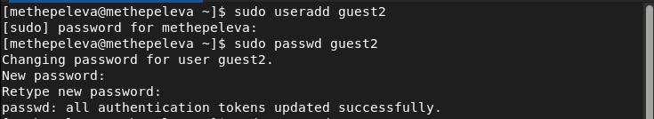{ #fig:1 width=90% }

2. Добавила пользователя guest2 в группу guest (Рис [@fig:2])

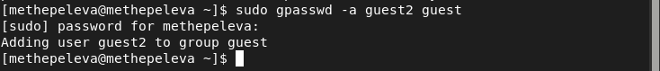{ #fig:2 width=90% }

3. Осуществила вход в систему от двух пользователей на двух разных консолях:
guest на первой консоли и guest2 на второй консоли (Рис [@fig:3])

{ #fig:3 width=90% }

4. Для обоих пользователей командой pwd определила директорию, в которой я нахожусь. Сравнила её с приглашениями командной строки - они совпадают (Рис [@fig:5] и Рис [@fig:6])

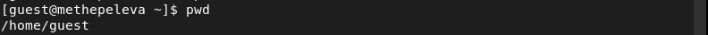{ #fig:5 width=90% }

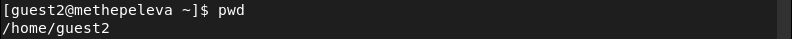{ #fig:6 width=90% }

5. Уточнила имя вашего пользователя, его группу, кто входит в неё и к каким группам принадлежит он сам. Guest имеет идентификатор 1001(guest), группа пользователя 1001(guest), состоит в группе 1001(guest). Guest2 имеет идентификатор 1002(guest2), группа пользователя 1002(guest2), состоит в группе 1002(guest2) и 1001(guest).
Определила командами groups guest и groups guest2, в какие группы входят пользователи guest и guest2.
Команда groups guest выдаёт группу guest. Команда groups guest2 выдаёт группу guest2.
Сравнила вывод команды groups с выводом команд id -Gn и id -G. Команда id -Gn выдает имя групп, команда id -G выдает id групп. (Рис [@fig:7] и Рис [@fig:8])

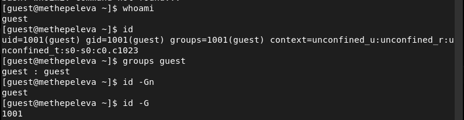{ #fig:7 width=90% }

{ #fig:8 width=90% }

6. Сравнила полученную информацию с содержимым файла /etc/group. Пользователь guest2 состоит в группе guest (Рис [@fig:9])

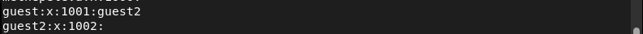{ #fig:9 width=90% }

7. От имени пользователя guest2 выполнила регистрацию пользователя guest2 в группе guest (Рис [@fig:10])

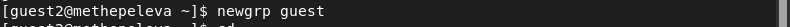{ #fig:10 width=90% }

8. От имени пользователя guest изменила права директории /home/guest,
разрешив все действия для пользователей группы (Рис [@fig:11])

{ #fig:11 width=90% }

9. От имени пользователя guest снял с директории /home/guest/dir1
все атрибуты и проверила правильность снятия атрибутов (Рис [@fig:12])

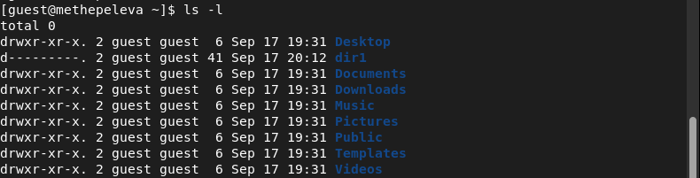{ #fig:12 width=90% }

10. Экспериментальным путём заполнила таблицу с правами и возможностями (Рис [@fig:13] и [@fig:14]).

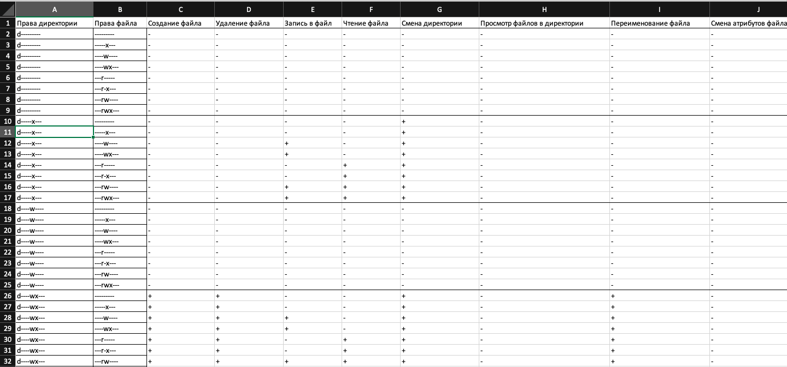{ #fig:13 width=90% }

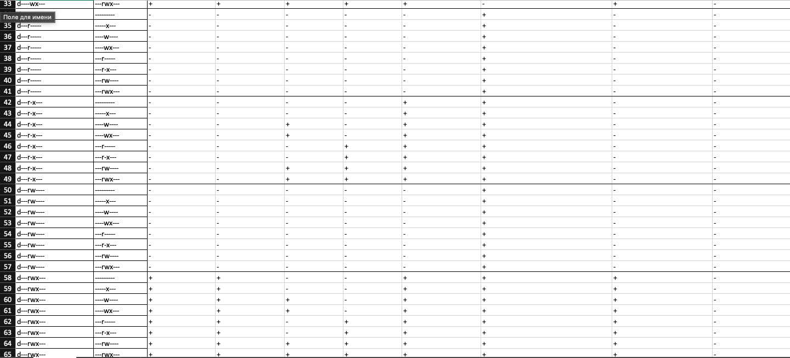{ #fig:14 width=90% }

11. В отдельной таблице указала минимальные права для определённых действий (Рис [@fig:15]).

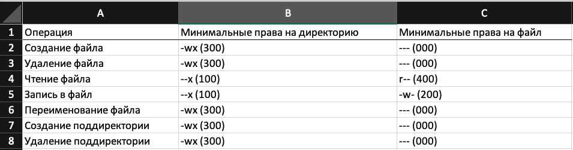{ #fig:15 width=90% }

# Выводы

Выполнив данную лабораторную работу, я создала второго нового пользователя, получилаы практические навыки работы в консоли с атрибутами файлов для групп пользователей.

# Список литературы

1. Кулябов, Д.С. - Лабораторная работа № 3. Дискреционное разграничение прав в Linux. Два пользователя
https://esystem.rudn.ru/pluginfile.php/1651885/mod_resource/content/4/003-lab_discret_2users.pdf
