#### РОССИЙСКИЙ УНИВЕРСИТЕТ ДРУЖБЫ НАРОДОВ
#### Факультет физико-математических и естественных наук  
#### Кафедра прикладной информатики и теории вероятностей 
#### ПРЕЗЕНТАЦИЯ ПО ЛАБОРАТОРНОЙ РАБОТЕ №6

###### дисциплина: Информационная безопасность
###### Преподователь: Кулябов Дмитрий Сергеевич
###### Студент: Щепелева Марина Евгеньевна
###### Группа: НФИбд-01-19
МОСКВА
2022 г.

---

# Цель работы

Целью данной лабораторной работы является развить навыки администрирования ОС Linux. Получить первое практическое знакомство с технологией SELinux1. Проверить работу SELinx на практике совместно с веб-сервером Apache.

---

# Выполнение лабораторной работы

1. Входим в систему с полученными учётными данными. Проверили, что SELinux работает в режиме enforcing политики targeted с помощью команд **getenforce** и **sestatus**.
   
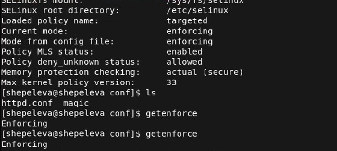

---

2. Запустили веб-сервер и обратились к нему с помощью команды:
service httpd status 
   
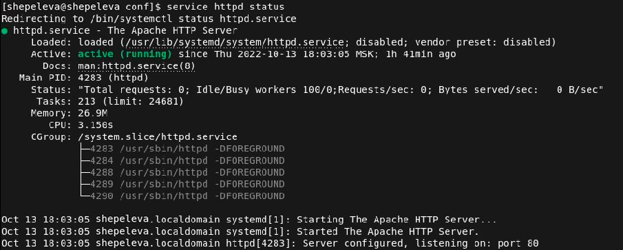

---

3. Найшли веб-сервер Apache в списке процессов с помощью команды **ps auxZ | grep httpd**. Контекст безопасности - unconfined_u:unconfined_r:unconfined_t. 
   
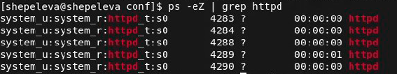

4. Посмотрели текущее состояние переключателей SELinux для Apache с помощью команды .
   
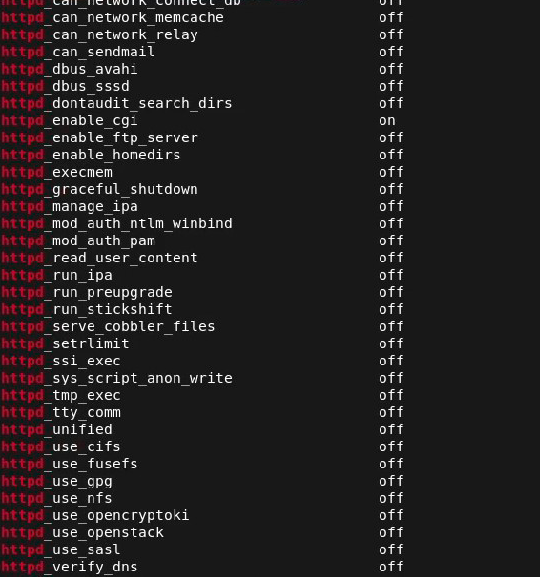

---

5. Определили тип файлов и поддиректорий, находящихся в директории /var/www, с помощью команды **ls -lZ /var/www**.
   
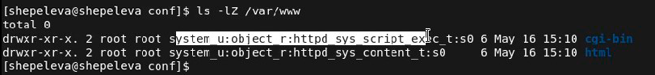
6. Создали от имени суперпользователя html-файл /var/www/html/test.html следующего содержания: 
   
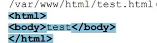

7. Проверили контекст созданного файла - httpd_sys_content_t.
   
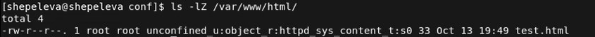

---

8.  Обратитились к файлу через веб-сервер, введя в браузере адрес http://127.0.0.1/test.html и убедились, что файл был успешно отображён. 
   
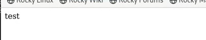

9.  Изменили контекст файла И проверили, что контекст поменялся.
   
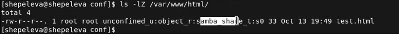

---

10. Пробуем ещё раз получить доступ к файлу через веб-сервер, введя в браузере адрес http://127.0.0.1/test.html. В результате получили ошибку.
   
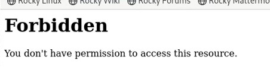

11. Попробуем запустить веб-сервер Apache на прослушивание ТСР-порта 81. Для этого в файле /etc/httpd/httpd.conf находим строчку Listen 80 и заменяем её на Listen 81.
   
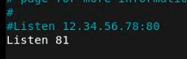
 
---

12. Выполним перезапуск веб-сервера Apache. Произошёл сбой? Нет. 
13. Выполним команду **semanage port -a -t http_port_t -р tcp 81**. Вылетает ValueError в связи с тем, что порт уже определен. После этого проверим список портов командой **semanage port -l | grep http_port_t** и убедились, что порт 81 появился в списке.
   
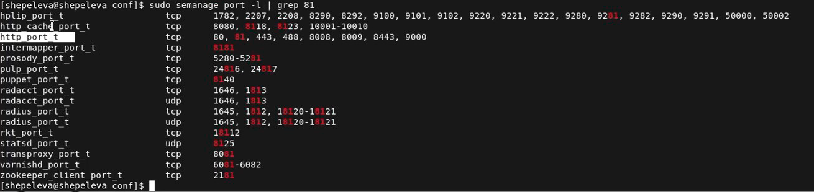
 
---

14. Вернули контекст httpd_sys_cоntent_t к файлу /var/www/html/test.html: **chcon -t httpd_sys_content_t /var/www/html/test.html** 
   
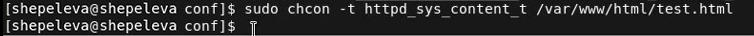

После этого пробуем получить доступ к файлу через веб-сервер, введя в браузере адрес http://127.0.0.1:81/test.html. В результате увидели содержимое файла — слово «test». 
   
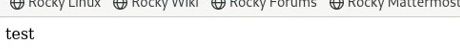
 
---

15. Исправим обратно конфигурационный файл apache, вернув Listen 80. 
   
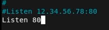

16. Удалим привязку http_port_t к 81 порту: **semanage port -d -t http_port_t -p tcp 81** и проверим, что порт 81 удалён. Данная команда не была выполнена. 
   
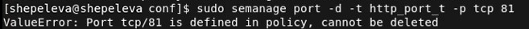

17.  Удалим файл /var/www/html/test.html: **rm /var/www/html/test.html**.
   
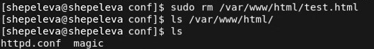
 
---

# Вывод

В ходе выполнения лабораторной работы мы развили навыки администрирования ОС Linux. Получили первое практическое знакомство с технологией SELinux1. Проверили работу SELinx на практике совместно с веб-сервером
Apache.
 
---