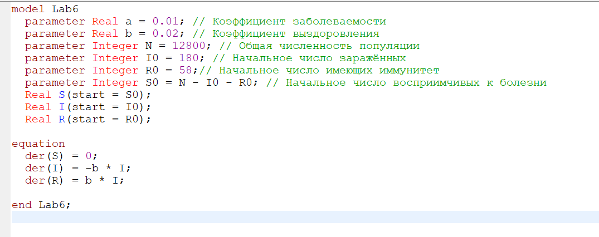
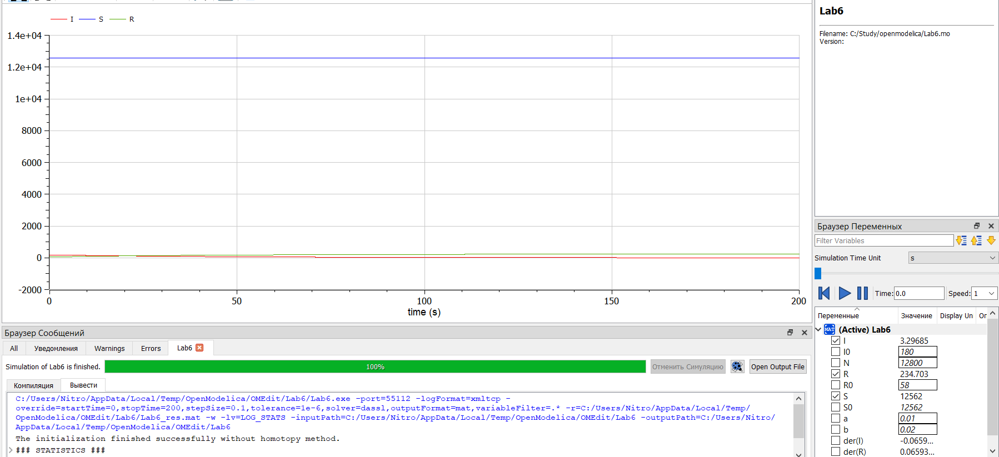
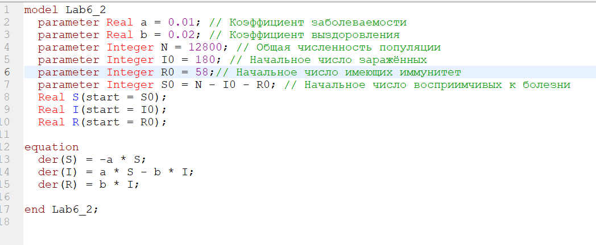
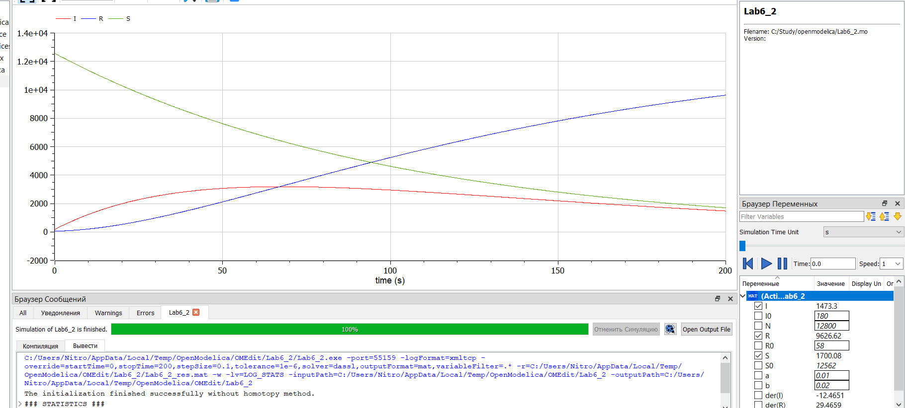

<h1 align="center">

РОССИЙСКИЙ УНИВЕРСИТЕТ ДРУЖБЫ НАРОДОВ 

Факультет физико-математических и естественных наук  

Кафедра прикладной информатики и теории вероятностей

ЗАЩИТА ЛАБОРАТОРНОЙ РАБОТЫ №6
  
<h2 align="right">

дисциплина: Математическое моделирование

Преподователь: Кулябов Дмитрий Сергеевич

Студент: Щепелева Марина Евгеньевна 

Группа: НФИбд-03-19
  
  
<h1 align="center">

МОСКВА

2022 г.
</h1>

# Содержание
* Прагматика
  - Задача об эпидемии
  - Постановка задачи
* Цели и задачи
* Выполнение
* Результаты
* Список литературы

# Прагматика
## Прагматика. Задача об эпидемии
$N$ - количество особей популяции

$S(t)$ - количество восприимчивых к болезни, но пока здоровых особей

$I(t)$ - количество инфицированных особей (распространителей инфекции)

$R(t)$ - количество здоровых особей с иммунитетом к болезни

$\alpha, \beta$ - коэффициенты заболеваемости и выздоровления соответственно

$I^*$ - критическое число заболевших

## Прагматика. Задача об эпидемии
Количество восприимчивых к болезни, но пока здоровых особей

$$\dfrac{dS}{dt} = \begin{cases}
   -\alpha S, &\text{если $I(t)>I^*$}\\
   0, &\text{если $I(t) \le I^*$} 
 \end{cases}$$

## Прагматика. Задача об эпидемии
Количество инфицированных особей (распространителей инфекции)

$$\dfrac{dI}{dt} = \begin{cases}
   -\alpha S -\beta I, &\text{если $I(t)>I^*$}\\
   -\beta I, &\text{если $I(t) \le I^*$} 
 \end{cases}$$

## Прагматика. Задача об эпидемии
Количество здоровых особей с иммунитетом к болезни

 $$\dfrac{dR}{dt} = \beta I$$

## Прагматика. Постановка задачи
*Вариант 20*: На одном острове вспыхнула эпидемия. Известно, что из всех проживающих на острове ($N=12 800$) в момент начала эпидемии ($t=0$) число заболевших людей (являющихся распространителями инфекции) $I(0)=180$, А число здоровых людей с иммунитетом к болезни $R(0)=58$. Таким образом, число людей восприимчивых к болезни, но пока здоровых, в начальный момент времени $S(0) = N - I(0) - R(0)$.

Постройте графики изменения числа особей в каждой из трех групп. Рассмотрите, как будет протекать эпидемия в случае:

1. если $I(0) \le I^*$
2. если $I(0)>I^*$

# Цели и задачи
1. Изучить задачу об эпидемии
2. Построить графики изменения числа особей в каждой из трёх групп: восприимчивые к болезни, но пока здоровые особи; инфицированные особи (распространители инфекции); здоровые особи с иммунитетом к болезни. Рассмотреть, как будет протекать эпидемия в двух случаях.

# Выполнение

Смоделируем графики изменения числа особей в каждой из трёх групп для первого случая (рис.2).

Смоделируем графики изменения числа особей в каждой из трёх групп для второго случая (рис.3).

# Результаты
1. Изучена задача об эпидемии
2. Построены графики изменения числа особей в каждой из трёх групп: восприимчивые к болезни, но пока здоровые особи; инфицированные особи (распространители инфекции); здоровые особи с иммунитетом к болезни. Рассмотрено, как будет протекать эпидемия в двух случаях.

# Список литературы
1. Методические материалы курса
2. Задания к лабораторной работе № 6 (по вариантам)