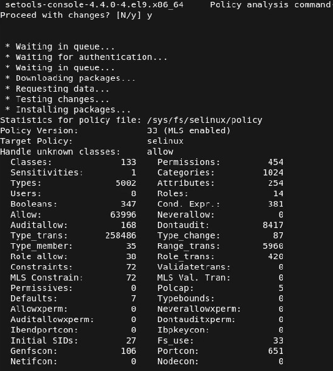
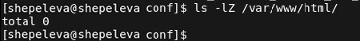
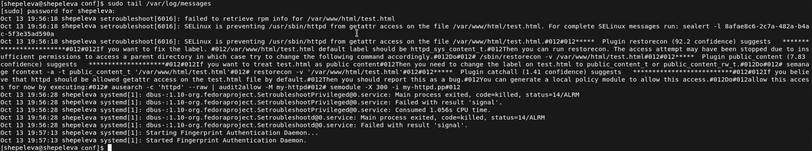
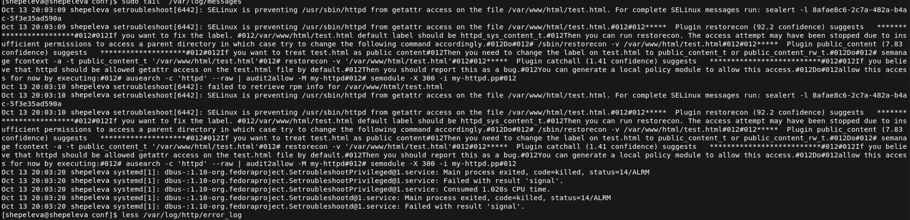
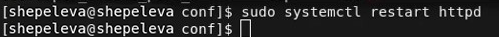

# Цель работы

Целью данной лабораторной работы является развить навыки администрирования ОС Linux. Получить первое практическое знакомство с технологией SELinux1. Проверить работу SELinx на практике совместно с веб-сервером
Apache.

# Подготовка лабораторного стенда и методические рекомендации

1. Установили веб-сервер Apache.
   

2. В конфигурационном файле /etc/httpd/httpd.conf задали параметр ServerName. 
   

3. Отключаем пакетный фильтр.

# Выполнение лабораторной работы

1. Входим в систему с полученными учётными данными. Проверили, что SELinux работает в режиме enforcing политики targeted с помощью команд **getenforce** и **sestatus**. (@fig:004)
   
{#fig:004 width=100%}

2. Запустили веб-сервер и обратились к нему с помощью команды (@fig:005):
service httpd status 
   
{#fig:005 width=100%}

3. Нашли веб-сервер Apache в списке процессов. Контекст безопасности - unconfined_u:unconfined_r:unconfined_t. (@fig:006)
   
{#fig:006 width=100%}

4. Посмотрели текущее состояние переключателей SELinux для Apache с помощью команды **sestatus -b | grep httpd**. (@fig:007)
   
{#fig:007 width=100%}

5. Посмотрели статистику по политике с помощью команды **seinfo**. Определили, что множество пользователей = 8; ролей = 14; типов = 5002. (@fig:008)
   
{#fig:008 width=100%}

6. Определили тип файлов и поддиректорий, находящихся в директории /var/www, с помощью команды **ls -lZ /var/www**. (@fig:009)
   
{#fig:009 width=100%}

7. Необходимо было определить тип файлов, находящихся в директории /var/www/html, с помощью команды **ls -lZ /var/www/html**. Но в данной директории файлов не обнаружилось. (@fig:010)
   
{#fig:010 width=100%}

8. Определим круг пользователей, которым разрешено создание файлов в директории /var/www/html - только uesr. (@fig:011)
   
{#fig:011 width=100%}

9. Создали от имени суперпользователя html-файл /var/www/html/test.html следующего содержания: (@fig:012)
   
{#fig:012 width=100%}

10. Проверили контекст созданного файла - httpd_sys_content_t. (@fig:013)
   
{#fig:013 width=100%}

11.  Обратитились к файлу через веб-сервер, введя в браузере адрес http://127.0.0.1/test.html и убедились, что файл был успешно отображён. (@fig:014)
   
{#fig:014 width=100%}

12.   Изучили справку man httpd_selinux. Тип файла test.html - контекст созданного файла - httpd_sys_content_t. (@fig:015)
   
{#fig:015 width=100%}

13.  Изменили контекст файла /var/www/html/test.html с httpd_sys_content_t на samba_share_t:
chcon -t samba_share_t /var/www/html/test.html
ls -Z /var/www/html/test.html
И проверили, что контекст поменялся. (@fig:016)
   
{#fig:016 width=100%}

14. Пробуем ещё раз получить доступ к файлу через веб-сервер, введя в браузере адрес http://127.0.0.1/test.html. В результате получили ошибку. (@fig:017)
   
{#fig:017 width=100%}

15.  Проанализируем ситуацию. Почему файл не был отображён, если права доступа позволяют читать этот файл любому пользователю?
ls -l /var/www/html/test.html
Просмотрим log-файлы веб-сервера Apache и системный лог-файл:
tail /var/log/messages
В системе оказались запущенны процессы **setroubleshootd** и **audtd**. (@fig:018)
   
{#fig:018 width=100%}

16. Попробуем запустить веб-сервер Apache на прослушивание ТСР-порта 81. Для этого в файле /etc/httpd/httpd.conf находим строчку Listen 80 и заменяем её на Listen 81. (@fig:019)
   
{#fig:019 width=100%}
 
17. Выполним перезапуск веб-сервера Apache. Произошёл сбой? Нет. 
18. Проанализируем лог-файлы:
tail -nl /var/log/messages
Просмотрим файлы /var/log/http/error_log,
/var/log/http/access_log и /var/log/audit/audit.log. (@fig:020)
   
{#fig:020 width=100%}

19. Выполним команду **semanage port -a -t http_port_t -р tcp 81**. Вылетает ValueError в связи с тем, что порт уже определен. После этого проверим список портов командой **semanage port -l | grep http_port_t** и убедились, что порт 81 появился в списке. (@fig:021)
   
{#fig:021 width=100%}

20. Попробуем запустить веб-сервер Apache ещё раз. (@fig:022)
   
{#fig:022 width=100%}
  
21. Вернули контекст httpd_sys_cоntent__t к файлу /var/www/html/test.html: **chcon -t httpd_sys_content_t /var/www/html/test.html** (@fig:023)
   
{#fig:023 width=100%}

После этого пробуем получить доступ к файлу через веб-сервер, введя в браузере адрес http://127.0.0.1:81/test.html. В результате увидели содержимое файла — слово «test». (@fig:024)
   
{#fig:024 width=100%}

22. Исправим обратно конфигурационный файл apache, вернув Listen 80. (@fig:025)
   
{#fig:025 width=100%}

23. Удалим привязку http_port_t к 81 порту: **semanage port -d -t http_port_t -p tcp 81** и проверим, что порт 81 удалён. Данная команда не была выполнена. (@fig:026)
   
{#fig:026 width=100%}

24.  Удалим файл /var/www/html/test.html: **rm /var/www/html/test.html**. (@fig:027)
   
{#fig:027 width=100%}

# Вывод

В ходе выполнения лабораторной работы мы развили навыки администрирования ОС Linux. Получили первое практическое знакомство с технологией SELinux1. Проверили работу SELinx на практике совместно с веб-сервером
Apache.

# Библиография

1. Кулябов Д. С., Королькова А. В., Геворкян М. Н. Мандатное разграничение прав в Linux [Текст] / Кулябов Д. С., Королькова А. В., Геворкян М. Н. - Москва: - 5 с. [^1]: Мандатное разграничение прав в Linux. 
2. Справочник 70 основных команд Linux: полное описание с примерами (https://eternalhost.net/blog/sozdanie-saytov/osnovnye-komandy-linux)
  